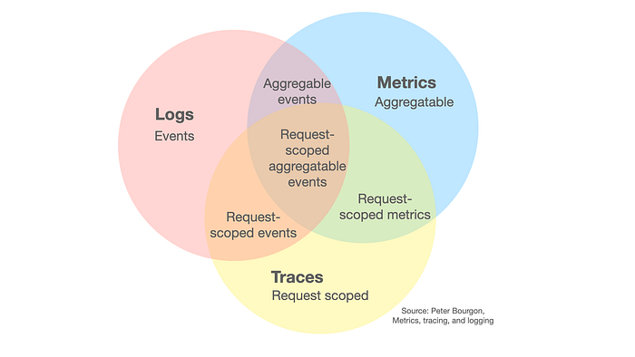

# 🎯 Ключевые концепции мониторинга

Прежде чем погружаться в конкретные инструменты, важно понимать фундаментальные концепции, которые лежат в основе большинства современных SRE-практик и систем мониторинга.

!!! abstract "Мониторинг — это не просто сбор графиков, это основа для принятия решений о надежности."

---

## 📈 SLO, SLI и SLA

Это основа современного подхода к **надёжности** систем.

Они позволяют перевести бизнес-требования (например, "сайт должен быть быстрым") на измеримый технический язык.

!!! note "SLI - Service Level Indicator / Индикатор уровня обслуживания"

    *   **Что это:** Конкретная, измеримая метрика. Это "что мы измеряем".
    *   **Примеры:** **Задержка ответа** (**latency**), **процент ошибок** (**error rate**), **пропускная способность** (**throughput**).

!!! note "SLO - Service Level Objective / Целевой уровня обслуживания"

    *   **Что это:** Цель, которую мы ставим для нашего SLI, измеряемая за определенный период (**окно оценки**, например, 28 дней). Это "насколько хорошо мы должны работать".
    *   **Пример:** `99.9%` запросов к API должны обрабатываться с задержкой менее `300ms` в течение последних 28 дней.

    !!! success ""

        Фокусируйтесь на SLO - это внутренний ориентир, который определяет баланс между разработкой новых функций и работой над надёжностью.

    Эта таблица переводит абстрактные «девятки» доступности в конкретное время простоя, которое может себе позволить сервис.

    | Процент доступности | Время простоя в месяц (30 дней) | Время простоя в год |
    | :--- | :--- | :--- |
    | 99% (Две девятки) | 7.2 часа | 3.65 дня |
    | 99.9% (Три девятки) | 43.2 минуты | 8.76 часа |
    | 99.99% (Четыре девятки) | 4.32 минуты | 52.56 минуты |
    | 99.999% (Пять девяток) | 25.9 секунды | 5.26 минуты |

!!! note "SLA - Service Level Agreement / Соглашение об уровне обслуживания"

    *   **Что это:** Формальный договор с клиентом, основанный на SLO. Нарушение SLA обычно влечет за собой финансовые штрафы.
    *   **Пример:** Если доступность API за месяц опустится ниже `99.9%` (цель из SLO), счёт клиента за текущий месяц будет уменьшен на `10%` в качестве компенсации.

### 💸 Бюджет на ошибки

!!! abstract "Что такое бюджет на ошибки?"

    **Бюджет на ошибки** — это допустимое время простоя вашего сервиса, которое является инверсией вашего **SLO**.

    *   **Формула:** `Бюджет на ошибки = (100% - SLO) * Период времени`
    *   **Пример:** Если SLO по доступности — `99.9%` в месяц, ваш бюджет на ошибки — это `0.1%` этого месяца (примерно 43 минуты), когда сервис может не работать без нарушения **SLO**.

    **Как это работает на практике:**

    *   **Есть бюджет?** ✅ Команда может рисковать: выпускать новые фичи, проводить эксперименты.
    *   **Бюджет исчерпан?** 🛑 Все рискованные действия замораживаются. Приоритет — только повышение **надёжности** (исправление багов, оптимизация).

    По сути, это механизм, который помогает командам самим решать, когда можно двигаться быстро, а когда — пора замедлиться и укрепить стабильность.

---

## 🔭 Три столпа наблюдения

<figure markdown="span">
  { width="750" }
  <figcaption>Рисунок 2. Три столпа наблюдаемости</figcaption>
</figure>

!!! abstract "Что такое Наблюдаемость (Observability)?"

    Это ключевая SRE-концепция, означающая возможность задать системе **любой вопрос** о ее внутреннем состоянии по внешним данным, которые она генерирует.

    Она построена на трех типах телеметрии, которые, работая вместе, обеспечивают полный контекст для диагностики и расследования.

    ---

    #### 📊 Метрики (Metrics)

    Метрики — это **агрегированные, числовые данные**, измеряемые в течение времени.
    Набор значений (чисел) с временной меткой и набором неизменяемых **меток (labels)**, которые описывают объект.

    Метрики являются **агрегатами событий** (например, количество запросов или средняя задержка за 15 секунд).

    *   **Идеально для:**
        *   **Алертинга:** Срабатывание триггера при превышении пороговых значений (например, 95% Latency $> 500$ мс).
        *   **Дашбордов:** Визуализация тенденций, выявление пиков и падений (например, график CPU).
    *   **Слабость:** Метрики показывают, **что** произошло, но не содержат достаточного контекста, **почему** это произошло.

    ---

    #### 📄 Логи (Logs)

    Логи — это неизменяемые, дискретные записи событий.
    Текстовая строка (или структурированный JSON-объект) с точной временной меткой и детальным описанием происшествия.

    *   **Идеально для:**
        *   **Глубокого расследования:** Поиск конкретных ошибок, идентификаторов сессий или ошибок парсинга.
        *   **Аудита:** Отслеживание действий пользователя или администратора.
    *   **Слабость:** Логирование всего подряд создает огромные объемы данных, которые тяжело агрегировать и анализировать в реальном времени.

    ---

    #### 🔀 Трейсы (Traces)

    Трейсы — это сквозной путь выполнения одного запроса через все компоненты распределенной системы.
    Набор последовательных **сегментов (spans)**, каждый из которых представляет собой операцию (вызов сервиса, запрос к БД, обработка очереди). Все сегменты связаны общим **Trace ID**.

    *   **Идеально для:**
        *   **Оптимизации производительности:** Выявление «бутылочных горлышек» и узких мест между микросервисами.
        *   **Картирования зависимостей:** Понимание того, какие сервисы зависят друг от друга.
    *   **Слабость:** Требует тщательной **инструментации** (внедрения кода) в приложение и не подходит для алертинга на регулярных метриках (CPU, RAM).

### 🔗 Взаимосвязь столпов

!!! abstract "Связи среди трех столпов наблюдения"

    Самая ценная информация для диагностики находится не в каждом столпе по отдельности, а на их пересечении.

    Возможность бесшовно переходить от одного типа данных к другому — ключ к быстрой и эффективной реакции на инциденты.

    ---

    #### 📈 **Метрики из логов**

    *   **Что это:** Создание числовых метрик на основе анализа текстовых логов.
    *   **Пример:** Система парсит логи веб-сервера, считает количество HTTP-ответов с кодом `500` и превращает это в метрику `http_server_errors_total`, на которую можно настроить алерт.

    ---

    #### 🔗 **Контекстные логи**

    *   **Что это:** Автоматическое добавление `Trace ID` и `Span ID` в каждую строку лога, относящуюся к конкретному запросу.
    *   **Пример:** Вы видите ошибку в логах. Копируете `Trace ID` из этой строки, вставляете его в систему трейсинга (Jaeger, Zipkin) и мгновенно получаете полную картину всего запроса.

    ---

    #### 🎯 **Метрики из трейсов**

    *   **Что это:** Возможность связать конкретную точку на графике метрик (например, всплеск задержки) с примером (`exemplar`) трейса, который вызвал это значение.
    *   **Пример:** На дашборде вы видите пик на графике Latency. Вы наводите на него курсор и видите ссылку на конкретный трейс, который «застрял» на 2 секунды.