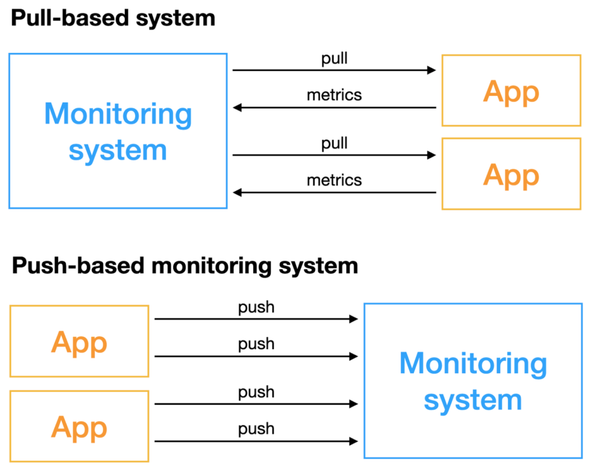

# 📊 Метрики

## ✨ Золотые сигналы

!!! abstract "Что отслеживать в первую очередь?"

    Для любого пользовательского сервиса Google рекомендует отслеживать четыре ключевые метрики, известные как **«Золотые Сигналы»**.

    Они дают комплексное представление о здоровье системы с точки зрения пользователя.

    ---

    #### 🐌 Задержка

    *   **Что это?** Время, которое требуется вашему сервису для обработки запроса. Важно разделять задержку для успешных и неуспешных запросов.
    *   **На что смотреть?** Не только на среднее значение, но и на перцентили (95-й, 99-й), чтобы понимать, как себя чувствует большинство пользователей.
    *   **Пример метрики:** `http_request_duration_seconds{quantile="0.95"}` — 95% запросов обрабатываются быстрее этого значения.

    ---

    #### 📈 Трафик

    *   **Что это?** Нагрузка на ваш сервис, измеряемая в специфичных для системы единицах. Для веб-сервиса это обычно количество HTTP-запросов в секунду.
    *   **На что смотреть?** На аномальные всплески или падения, которые могут сигнализировать о проблемах (DDoS-атака, сбой у клиента).
    *   **Пример метрики:** `rate(http_requests_total[5m])` — среднее количество запросов в секунду за последние 5 минут.

    ---

    #### 💥 Ошибки

    *   **Что это?** Частота запросов, которые завершаются ошибкой. Ошибки могут быть явными (например, HTTP 500) или неявными (HTTP 200, но с некорректным содержимым).
    *   **На что смотреть?** На рост частоты ошибок. Важно отличать ошибки сервера (5xx) от ошибок клиента (4xx), так как они требуют разной реакции.
    *   **Пример метрики:** `rate(http_requests_total{code=~"5.."}[5m])` — частота серверных ошибок за последние 5 минут.

    ---

    #### 🔋 Насыщенность

    *   **Что это?** Насколько «загружен» ваш сервис. Это самый сложный для измерения сигнал, так как он показывает, насколько близка система к пределу своей производительности.
    *   **На что смотреть?** На ресурсы, которые быстрее всего закончатся (CPU, память, дисковое пространство, количество потоков).
    *   **Пример метрики:** `1 - avg_over_time(node_cpu_seconds_total{mode="idle"}[5m])` — утилизация CPU (доля времени, когда CPU не простаивал).

    !!! info "Источник"

        Концепция подробно описана в книге [**Google SRE Book**](https://sre.google/sre-book/service-level-objectives/).

---

## 📥 Модели сбора данных

<figure markdown="span">
  { width="500" }
  <figcaption>Рисунок 1. Pull vs Push</figcaption>
</figure>

| Критерий | Pull-модель (e.g., Prometheus) | Push-модель (e.g., Zabbix) |
| :--- | :--- | :--- |
| **Инициатор связи** | Сервер мониторинга | Агент на хосте |
| **Сетевая доступность** | Сервер должен "видеть" все цели.   *Сложно за NAT/Firewall.* | Агент должен "видеть" сервер.   *Отлично работает за NAT/Firewall.* |
| **Обнаружение целей** | Легко автоматизируется (service discovery). | Требует ручной или автоматической регистрации агентов. |
| **Простота агента** | Агент очень простой (часто просто веб-сервер). | Агент сложнее (логика отправки, буферизация). |
| **Контроль данных** | Сервер контролирует частоту и объём сбора данных. | Агент решает, когда и что отправлять. |

---

## TODO: Типы метрик (Counters, Gauges, Histograms)
