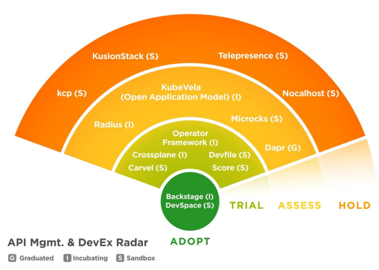
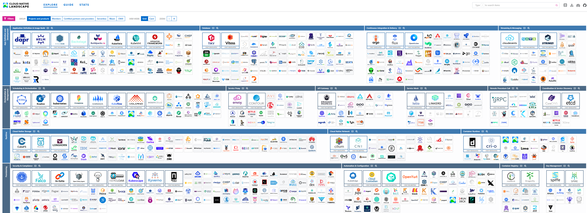

# 🧭 Фреймворк выбора технологий CNCF и Cloud Native

!!! abstract "Философия Cloud Native"

    **Cloud Native** — это не просто "запуск приложений в облаке".

    Это архитектурный и культурный подход к созданию и эксплуатации приложений, который использует все преимущества облачной модели вычислений.

    Ключевые столпы этого подхода:

    *   **Контейнеризация**: Изоляция приложений и их зависимостей (например, с помощью `Docker`).
    *   **Микросервисы**: Разделение монолитных приложений на небольшие, независимо развёртываемые сервисы.
    *   **Декларативное API и Автоматизация**: Управление инфраструктурой и приложениями как кодом (`IaC`, `GitOps`).
    *   **Наблюдаемость (Observability)**: Глубокое понимание состояния системы через метрики, логи и трейсы.

    В этом мире сотни инструментов, и **CNCF** — это ваш главный навигатор.

---

## 🗺️ Что такое CNCF?

!!! info "Cloud Native Computing Foundation (CNCF) — это дочерняя организация `The Linux Foundation`, созданная для продвижения и стандартизации технологий Cloud Native."

!!! note "Роль CNCF"

    CNCF **не разрабатывает** проекты.
    Её миссия — быть **нейтральным, вендор-независимым "домом"** для критически важных open-source проектов, предоставляя им управление, маркетинг и поддержку сообщества.

    Главная цель — предотвратить "привязку" к одному облачному провайдеру или коммерческой компании.

### 🏆 Уровень зрелости

!!! success "Что такое Уровень Зрелости (Maturity Level)?"

    Это формальная оценка от CNCF, которая отражает **зрелость проекта**: его управление, стабильность кода, размер сообщества и принятие в индустрии.

CNCF классифицирует проекты по трём уровням. Это ваш **первый фильтр** для оценки рисков.

| Уровень | Описание | Что это значит для вас? |
| :--- | :--- | :--- |
| **Sandbox** | **"Песочница"**. Проекты на самой ранней стадии. | **Изучать, экспериментировать**. Не использовать в production. |
| **Incubating** | **"Инкубация"**. Проекты, доказавшие свою ценность. | **Можно пробовать в production** с осторожностью. |
| **Graduated** | **"Выпускники"**. Зрелые, проверенные в боях стандарты. | **Смело использовать в production**. |

### 📡 Ежеквартальные срезы

!!! success "Что такое ежеквартальный срез (Radar)?"

    **CNCF Technology Radar** — это ежеквартальный отчёт, который отражает **мнение сообщества** о том, какие технологии стоит использовать.
    
    В отличие от Landscape (каталога), о котором речь пойдет ниже, Radar — это **рекомендация**.

<figure markdown="span">
  
  <figcaption>Рисунок 1. Ежеквартальный срез на тему API менеджмента (май 2025 года)</figcaption>
</figure>

| Кольцо | Значение | Рекомендация |
| :--- | :--- | :--- |
| **ADOPT** | **"Внедрять"**. Технология проверена и рекомендуется для широкого использования. | Если вы ещё не используете, серьёзно рассмотрите. |
| **TRIAL** | **"Пробовать"**. Перспективная технология, стоит попробовать на некритичных проектах. | Выделите время на PoC (Proof of Concept). |
| **ASSESS** | **"Оценивать"**. Многообещающая, но ещё слишком новая технология. | Следите за развитием, но пока не внедряйте. |
| **HOLD** | **"Держаться подальше"**. Устаревшая или проблемная технология. | Избегайте в новых проектах. |

!!! info "Подробнее см. в (источнике) 👉 [**Официальный сайт CNCF Technology Radar**](https://radar.cncf.io/)"

### 🗺️ Карта экосистемы

!!! success "Что такое карта экосистемы (Landscape)?"

    **CNCF Cloud Native Interactive Landscape** — это интерактивная карта, которая пытается каталогизировать **все** проекты в экосистеме, а не только те, что в CNCF.

<figure markdown="span">
  
  <figcaption>Рисунок 2. Карта экосистемы от CNCF</figcaption>
</figure>

!!! warning " Landscape огромен. Используйте его как справочник для поиска инструментов в конкретной категории, а не как учебный план."

!!! info "Подробнее см. в (источнике) 👉 [**Официальный сайт CNCF Landscape**](https://landscape.cncf.io/)"

---

## 🛠️ Выбор инструментария

Теперь, когда мы знакомы с основными навигационными инструментами, можно собрать их в единый процесс принятия решений, основанный на управлении рисками.

!!! note "Две разные шкалы"

    Важно не путать **уровень зрелости** проекта с **рекомендациями из радаров**. <br>
    Это две независимые оценки, которые служат разным целям.

| Шкала | Уровень зрелости (Maturity Level) | Технологический радар (Technology Radar) |
| :--- | :--- | :--- |
| **Что оценивает** | Стабильность проекта, размер его сообщества и принятие в индустрии. | Мнение практикующих инженеров о готовности технологии к использованию. |
| **Периодичность** | Меняется редко (годы). | Обновляется ежеквартально. |
| **Главная цель** | Помочь оценить надёжность и долгосрочные риски. | Помочь сориентироваться в текущих трендах и выбрать инструмент для конкретной задачи. |

!!! example "Пошаговый алгоритм выбора SRE"

    **Этап 1: Обзор рынка (Landscape):** Используйте **CNCF Landscape** для поиска всех кандидатов в нужной категории.
        
    **Этап 2: Фильтрация по Риску (Maturity Level):**

    *   Для **Mission-Critical** систем (оркестрация, безопасность, мониторинг) — **ТОЛЬКО** *Graduated* (например, *Kubernetes*, *Prometheus*).
    *   Для **Business-Critical** систем (CI/CD, Service Mesh) — *Incubating* (с обязательное оценкой пригодности).
    *   *Sandbox* — строго для **PoC (Proof of Concept)** и изучения.
        
    **Этап 3: Сверка с Трендом (Technology Radar):** Найдите последний **Technology Radar** по вашей теме.

    *   Проекты в кольце **`Adopt`** — ваши **приоритеты** для Production.
    *   Проекты в кольце **`Trial`** — **перспективные альтернативы**, которые стоит протестировать, чтобы оценить их применимость в вашей архитектуре.

---

## 🧐 Оценка пригодности

!!! danger "Не доверяй, а проверяй"

    Статус в CNCF и рекомендации сообщества — это лишь **фильтр первого уровня**.

    Как SRE/DevOps, вы должны глубоко проанализировать проект по операционным метрикам, которые напрямую влияют на **сложность эксплуатации (Operational Overhead)**.

### 🤝 Здоровье проекта

!!! question "Почему это важно?"

    Принимая open-source проект, вы вступаете в неявные отношения с его сообществом. <br>
    От здоровья этих "отношений" зависит, получите ли вы помощь в критической ситуации или останетесь с проблемой один на один.

| Метрика (GitHub) | Требование для production | Риск, если отсутствует |
| :--- | :--- | :--- |
| **Активность коммитов** | Стабильно **10+ коммитов в месяц** от разных контрибьюторов. <br> Проверяйте ветку `main`/`master`. | Проект заброшен. <br> Критически важные исправления придется делать самостоятельно. |
| **Скорость реакции (Issue/PR)** | **Время первого ответа** на критические баги: `≤ 24` часов. <br> **Среднее время слияния PR**: `≤ 14` дней. | Ваше Production-время простоя (Downtime) будет зависеть от неторопливости мейнтейнеров. |
| **Разнообразие контрибьюторов** | Желательно, чтобы **топ-3 контрибьютора** принадлежали разным компаниям. | Риск **Vendor Lock-in**. <br> Если мейнтейнер-компания меняет фокус, ваш проект может быть заморожен. |
| **Наличие Roadmap** | Чёткий, публичный план развития на 6-12 месяцев. | Невозможно планировать интеграцию будущих функций или готовиться к *Breaking Changes*. |

!!! warning "Осторожно: Vendor-Driven проекты"

    Разнообразие контрибьюторов — это не просто красивая метрика, а защита от скрытого **Vendor Lock-in**.

    Обращайте внимание на следующие признаки:

    *   **Непропорциональный вклад:** Если одна компания является автором >80% коммитов, её интересы всегда будут в приоритете.
    *   **"Open Core" модель:** Ядро проекта — open source, но все самые ценные функции (безопасность, масштабирование, управление) доступны только в платной, enterprise-версии от вендора. Проект в таком случае — это, по сути, "воронка продаж".
    *   **Интеграции:** Проект "из коробки" лучше всего работает с другими продуктами того же вендора, а интеграция с альтернативами затруднена.

    Такие проекты не обязательно плохие, но вы должны осознавать, что вы принимаете не просто технологию, а и бизнес-модель конкретной компании.

### ⚙️ Пригодность

!!! question "Почему это важно?"

    Функциональность инструмента — это лишь половина дела. <br>
    Вторая, и часто более важная половина, — это **стоимость его эксплуатации (Operational Cost)**.

    Идеальный инструмент легко интегрируется, наблюдается и обновляется.

| Аспект | Требование для Production | Почему это важно |
| :--- | :--- | :--- |
| **Наблюдаемость (Observability)** | ✅ Наличие **Prometheus Exporter**, который отдает как минимум **4 Golden Signals**:<br>    *   **Latency:** Время ответа.<br>    *   **Traffic:** Нагрузка (RPS, throughput).<br>    *   **Errors:** Уровень ошибок.<br>    *   **Saturation:** Насыщение (насколько "заполнен" сервис).<br> ✅ Логи в **Structured Format (JSON)**.<br> ✅ Поддержка **Tracing (OpenTelemetry)**. | Если вы не можете измерить производительность и понять причину ошибки за 5 минут, инструмент слишком дорогой в эксплуатации. |
| **Конфигурация** | Управление через **Kubernetes Custom Resources (CRDs)**, **Helm Charts** или **Kustomize** с возможностью переопределения всех параметров. | Управление должно быть **декларативным** и входить в ваш **GitOps**-процесс. <br> Избегайте "чёрных ящиков", требующих ручных команд. |
| **Upgrade / Rollback Strategy** | ✅ Поддержка **Zero-Downtime Upgrade**. <br> ✅ Задокументированный **"Upgrade Path"** (например, "обновление только с N до N+1"). <br> ✅ **Чёткий процесс Rollback** на предыдущую версию. | Операции должны быть предсказуемыми. <br> Невозможность отката или риск простоя при обновлении — **Production-Killer**. |
| **Ресурсы (Resources)** | Предопределённые **Resource Requests/Limits** в документации или Helm-чарте, основанные на реальном использовании. | Крайне важно для контроля стоимости и предотвращения *OOMKills* (Out Of Memory) в Production. |

### 📦 Эксплуатация

Помимо базовой пригодности, зрелый для Production инструмент должен легко встраиваться в существующую экосистему.

| Аспект | Требование для Production | Почему это важно |
| :--- | :--- | :--- |
| **Наличие Оператора** | ✅ Существует официальный или поддерживаемый сообществом **Kubernetes Operator**. | Оператор автоматизирует сложные задачи управления (установку, обновления, бэкапы, восстановление после сбоев), значительно снижая **Operational Overhead**. |
| **HA и Disaster Recovery** | ✅ В документации описаны паттерны для развертывания в режиме высокой доступности (High Availability). <br> ✅ Есть рекомендации по резервному копированию и восстановлению. | Вы должны быть уверены, что инструмент переживет падение одной ноды или даже целого дата-центра. <br> Отсутствие HA-сценариев — признак незрелости. |
| **Интеграция с экосистемой** | ✅ Поддержка популярных инструментов **GitOps** (`ArgoCD`, `Flux`). <br> ✅ Интеграция с системами управления секретами (`Vault`). <br> ✅ Совместимость с платформами для разработчиков (`Backstage`). | Инструмент не живет в вакууме. <br> Он должен быть "гражданином" вашей Cloud Native платформы, а не чужеродным элементом. |

### 🛡️ Безопасность

!!! question "Почему это важно?"

    Уязвимость в одном компоненте может скомпрометировать всю систему. <br>
    Неправильная лицензия может создать огромные юридические риски для компании.

*   **Аудит Безопасности (Security Audit):** Проекты уровня *Graduated* **обязательно** проходят независимый аудит. Для *Incubating* это желательный, но не обязательный аспект. Если аудит проводился, внимательно изучите отчёт.
*   **CVE-процедура:** У проекта должна быть публичная или приватная процедура сообщения об уязвимостях (CVE). Проверьте, как быстро они выпускают патчи для критических уязвимостей (обычно это происходит в течение 72 часов).
*   **Предсказуемая политика безопасности (Security Release Policy):** Это отдельный, критически важный документ, а не просто наличие CVE-процедуры. Ищите формализованную политику, как у Kubernetes: с чёткими сроками исправления уязвимостей разной критичности и закрытым процессом раскрытия информации до выхода патча. Это признак зрелого проекта, который серьезно относится к безопасности.
*   **Лицензия:** Всегда проверяйте совместимость лицензии с корпоративными стандартами. **Apache 2.0** и **MIT** — наиболее дружественные для бизнеса. Избегайте лицензий, которые требуют публикации вашего кода (например, некоторые модификации *GPL*).
*   **Цепочка поставок (Supply Chain Security):** Проверьте, подписываются ли артефакты проекта (контейнерные образы, бинарные файлы) с помощью `Sigstore`/`Cosign`. Наличие **SBOM (Software Bill of Materials)** — огромный плюс, позволяющий отслеживать уязвимости в зависимостях.
*   **Частота обновления зависимостей:** Убедитесь, что базовые образы и ключевые зависимости регулярно обновляются. Проект, использующий `alpine:3.10` в 2025 году — это красный флаг.

### 💰 Экономические риски

!!! abstract "Техническое совершенство — ничто, если его внедрение экономически нецелесообразно. TCO (Total Cost of Ownership) — это не только цена лицензии, но и множество скрытых затрат."

| Аспект | На что обратить внимание | Почему это важно |
| :--- | :--- | :--- |
| **Стоимость обучения** | Насколько сложен инструмент? Есть ли качественная документация и обучающие материалы? Сколько времени уйдет на то, чтобы команда начала им уверенно пользоваться? | Высокий порог входа замедляет внедрение и увеличивает риск ошибок. |
| **Наличие специалистов** | Легко ли найти на рынке инженеров с опытом работы с этой технологией? Какова их стоимость? | Выбирая редкий или сложный инструмент, вы рискуете столкнуться с кадровым голодом и завышенными зарплатными ожиданиями. |
| **Совместимость со стеком** | Насколько хорошо инструмент интегрируется с уже используемыми в компании технологиями (языками программирования, фреймворками, облачными провайдерами)? | Несовместимость порождает необходимость в "костылях" и переходниках, что усложняет и удорожает поддержку. |
| **Стоимость поддержки** | Что вы будете делать, если столкнетесь с критическим багом, а сообщество не отвечает? Есть ли опция коммерческой поддержки от вендора и сколько она стоит? | Стоимость поддержки своими силами (форк и исправление багов) может многократно превысить стоимость коммерческой лицензии. |

---

## ✅ Итоговый чек-лист

!!! abstract "Памятка: 8 шагов перед внедрением нового инструмента"

    1.  **Определить критичность системы:** Это `Mission-Critical` или `Business-Critical`?
    2.  **Проверить уровень зрелости CNCF:** Соответствует ли он нашей политике рисков (*Graduated* / *Incubating*)?
    3.  **Найти в Technology Radar:** Что думает сообщество? Это `Adopt`, `Trial` или что-то, за чем пока лучше просто наблюдать?
    4.  **Проанализировать здоровье проекта:** Изучить активность на GitHub, скорость реакции и разнообразие контрибьюторов. Оценить риски Vendor Lock-in.
    5.  **Оценить операционную зрелость:** Есть ли наблюдаемость "из коробки", понятная стратегия обновлений, Kubernetes-оператор и HA-паттерны?
    6.  **Проверить безопасность и лицензию:** Пройден ли аудит, есть ли SBOM и предсказуемая **Security Release Policy**? Совместима ли лицензия?
    7.  **Проверить совместимость со стеком:** Насколько хорошо инструмент впишется в существующие процессы и технологии компании?
    8.  **Оценить TCO:** Каковы будут реальные затраты на внедрение и поддержку, включая обучение, наём и **человеко-часы на эксплуатацию (OpEx)**?

???+ example "Шаблон для оценки технологии"

    *Скопируйте этот шаблон в вашу внутреннюю wiki (Confluence, Notion и т.д.) и заполните его для каждого нового инструмента, который вы рассматриваете для внедрения в Production.*

    ```markdown
    ---

    ### **Проект:** [Название, например, "Cilium"]

    *   **Дата оценки:** YYYY-MM-DD
    *   **Оценку проводил:** [Ваше имя/команда]

    ### 1. 📝 Краткое описание

    *   **Проблема:** Какую конкретную проблему мы решаем с помощью этого инструмента?
        > Например: "Нам нужен CNI-плагин для Kubernetes, который обеспечивает продвинутые сетевые политики и высокую производительность без использования sidecar-прокси".
    *   **Решение:** Как этот инструмент решает проблему (в 1-2 предложениях)?
        > Например: "Cilium использует eBPF для обеспечения сетевой связности, наблюдаемости и безопасности непосредственно в ядре Linux, что обещает высокую производительность и низкие задержки".
    *   **Категория CNCF Landscape:** [Например, "Cloud Native Network"]

    ### 2. 📈 Стратегическое соответствие

    *   **Критичность для бизнеса:** Mission-Critical / Business-Critical / Nice-to-have
    *   **Соответствие стеку:**
        *   Комментарий: Насколько хорошо интегрируется с [Наш основной язык/фреймворк/облако]?
    *   **Стоимость владения (TCO) - предварительная оценка:**
        *   **Специалисты на рынке:** Высокая доступность / Средняя / Редкие специалисты
        *   **Порог входа (Learning Curve):** Низкий / Средний / Высокий
        *   **Коммерческая поддержка:** Доступна от [Вендор] / Только Community
        *   **Предполагаемые затраты на эксплуатацию (OpEx):** [Например: 0.25 FTE инженера на поддержку, $XXX на дополнительные серверы для мониторинга]

    ### 3. 🛠️ Технический анализ (Due Diligence)

    *   **Зрелость и сообщество:**
        *   **Уровень зрелости CNCF:** Graduated / Incubating / Sandbox / N/A
        *   **Позиция в Technology Radar:** Adopt / Trial / Assess / Hold / N/A
        *   **Активность на GitHub:** [Ссылка на репозиторий].
            *   Комментарий: Активность коммитов, скорость реакции на Issues/PRs.
        *   **Управление:** Community-driven / Vendor-driven ([Название вендора])

    *   **Операционная зрелость:**
        *   **Observability:** Есть Prometheus Exporter / Нет. Поддерживает Golden Signals: Да/Нет.
        *   **Установка/Конфигурация:** Helm Chart / Operator / Ручная.
        *   **Обновления:** Есть Zero-downtime / Требуется простой. Есть Rollback: Да/Нет.
        *   **HA/DR:** Документировано / Не документировано.
        *   **Интеграция с экосистемой:** ArgoCD/Flux, Vault, Backstage и т.д.

    *   **Безопасность:**
        *   **Аудит безопасности:** Пройден [Дата] / Не проводился.
        *   **SBOM:** Предоставляется / Нет.
        *   **Image Signing (Sigstore):** Используется / Нет.
        *   **Лицензия:** [Название лицензии]. Совместимость с политикой компании: Да/Нет.

    ### 4. 🏁 Итоговое решение

    *   **Рекомендация:** Внедрять / Провести PoC / Отклонить / Наблюдать
    *   **Основные риски:**
        1.  [Главный технический или операционный риск]
        2.  [Главный бизнес-риск (стоимость, специалисты)]
    *   **Следующие шаги:**
        > Например: "Развернуть в dev-окружении для тестирования производительности", "Составить план PoC на Q3", "Провести внутренний воркшоп для команды".
    ```

---

## 💡 Актуализация знаний

!!! tip "Советы по поддержанию знаний в актуальном состоянии"
    *   Читайте **блог CNCF** и смотрите их **вебинары** на YouTube.
    *   Смотрите доклады с **KubeCon / CloudNativeCon** — это главный источник информации о трендах.
    *   Изучайте ежегодные отчёты, например, **"State of Cloud Native Development"** от SlashData.
    *   Присоединяйтесь к **open-source сообществам в Slack**. Это лучший способ быть в курсе критических обновлений, получать помощь и следить за развитием проектов.

!!! info "Slack-сообщества"

    У меня есть отдельное руководство по Slack, где описаны его ключевые функции, правила этикета и список самых важных каналов в мире Cloud Native, SRE, DevOps.

    👉 [**Читать руководство по Slack**](./slack.md)